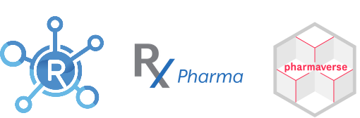
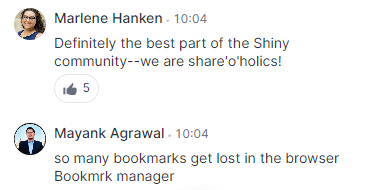

---
output:
  xaringan::moon_reader:
    self_contained: false
    lib_dir: libs
    nature:
      highlightLines: true
      highlightLanguage: R
      countIncrementalSlides: false
---


```{r startup, include = FALSE, message = FALSE, warning = FALSE, cache=TRUE}

```
```{r xaringanExtra, echo=FALSE, include = FALSE}
library(dplyr)
library(countdown)
# "share_again",
xaringanExtra::use_xaringan_extra(c("tile_view", "animate_css", "scribble", "search", "webcam", "clipboard", "fit_screen", "tachyons", "editable")) 
# xaringanExtra::use_animate_all("slide_left")
# xaringanExtra::use_logo(
#   image_url = "https://en.wikipedia.org/wiki/Biogen#/media/File:Biogen.svg",
#   link_url = "https://www.biogen.com/"
# )
xaringanExtra::use_extra_styles(
  hover_code_line = TRUE,         #<<
  mute_unhighlighted_code = TRUE  #<<
)
countdown(minutes = 0, seconds = 15)
```

layout: false
class: title-slide, inverse, middle, main_slide
name: title-slide


# '75 Soft' for Software Devs
### 75 Days of professional development
## [Posit Conf 2023 CFP](https://posit.co/conference/)


Aaron Clark
---
# Who is Aaron Clark?

.pull-left[


]
.pull-right[
* Principal Data Scientist | Biogen

* R Validation Hub Exec

* R/Pharma Program Committee

* Pharmaverse Pkg Maintainer
  - {riskassessment}
  - {tidyCDISC}


]


---
# Who is Aaron Clark?

<br>


---
class: inverse, center, middle
# Can you relate?

---
# Shiny Conf 2023

.pull-left[

]

.pull-right[
<br>



]

???
### FOMO can only motivate us for so long)

---
# Shiny Conf 2023

.pull-left[]
.pull-right[
<br>


]

???
### FOMO can only motivate us for so long)

---
class: inverse, center, middle

# The problem is clear


???
### It's hard to keep up with all the open source world has to offer.
### The folks on the previous slide are actually pretty agressive
### If your like me, you'll leave this tabe group open for a week and a half, but then shamefully close it in dispair, wishing you had the gumption learn like Eric Nantz

---

layout: false
class: middle, center
name: what

## But, there's **too much** to learn with **too little** time.

.bg-washed-green.b--dark-green.ba.bw2.br3.shadow-5.ph4.mt5[
The more I learn, the more I realize how much I don't know.
.tr[
— Albert Einstein
]]

<br>

<br>


Source: [goodreads.com](https://www.goodreads.com/quotes/620163-the-more-i-learn-the-more-i-realize-how-much)

???
### I'm not even scratching the surface. But we try to not let it overwhelm us, and we don't have enough time

---
class: inverse, center, middle

# HAVING TIME
# VS. MAKING TIME

<br>

## THERE'S A DIFFERENCE

???
### That's right, this talk is all about discipline

---
# 75 Hard - viral mental toughness challenge

Daily checklist:
```
1. Follow a diet

2. 2 x 45 minute workouts (one has to be outside)

3. Drink 1 Gallon of Water

4. Read 10 pages of non-fiction (personal dev, no audiobooks)

5. Take progress pictures
```
--


???
### Every item in this checklist are designed to push you. It's very hard.
### It's not a fitness challenge, it's a **mental toughness** challenge.
### Creator claims only 5% of people who try can finish

---
class: inverse, center, middle
# But why?


<!--  -->

???
### Pain & suffering refine us, making become stronger & more confident.

---
class: inverse, center, middle

# What if I applied these principles to other areas of my life?


Enter: 75 Soft for software devs

---
# 75 Soft for software devs

**Daily** checklist for software dev dev:
```
1. Devour one learning resource you've been wanting to consume

2. Contribute on two projects (one has to be open source)

3. Watercooler - share your learnings on social media

4. Read 10 pages of a software dev book

5. Track your progress in Quarto/ Rmarkdown
```

---
# I'm currently doing it


Outcomes & Lesson's learned (so far):
* There are soooo many quality learning resources
* More productive
* Appetite to learn has grown
* Knowledgeable resource for my team
* Open source presence has exploded
* Confidence booster!
* If I don't schedule time for it, it won't happen
* I will always need quality accountability

---
# Join me

I'd do it again. I need accountability partners!

R4DS slack?


---
class: inverse, center, middle

# Thank you!


