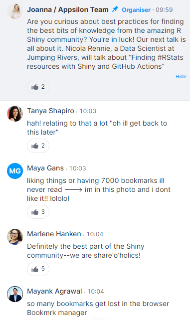
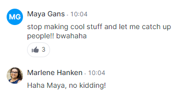
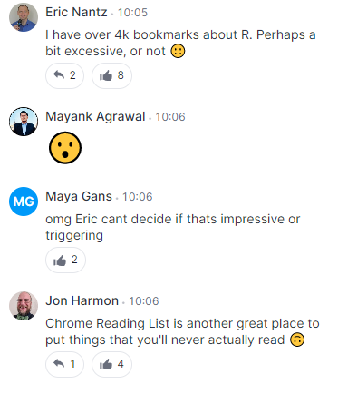
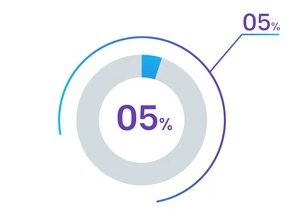
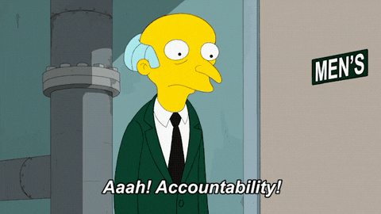

<!-- README.md is generated from README.Rmd. Please edit that file -->

# 75 Soft: 75 Days of software development

FYI, this `README` aims to serve as a general outline for my talk @
Posit::conf 2023. It is a living document and will change as I develop
additional content for the talk.

### Abstract

Viral 75-day challenges claim to develop your physical & entrepreneurial
prowess, but none seek to grow the discipline & mental toughness needed
as a software developer. This talk provides a brief history of these
experiments & acknowledges the potential upside when applied in the
right context. “75 Soft for Software Devs” proposes an ambitious, yet
attainable checklist of daily habits aimed to boost your overall
appetite to learn and confidence to share with others. We’ll discuss
lessons learned & advice from past attempts, plus you guessed it: we’ll
even extend a personal invitation to join a community-based ‘75 soft’
challenge for yourselves. Who knows, this challenge may serve as the
catalyst you didn’t know you needed. Let’s get soft!

## Can you relate?

At Shiny Conf 2023, during a talk discussing best practices for finding
R Shiny resources, this conversation was breaking out in the chat:

   
  

## The problem is clear

- It’s hard to keep up with all the open source world has to offer.

- If your like me, you’re FOMO will leave this tab group open for a week
  and a half, but then shamefully close it out of despair, wishing you
  had the gumption learn like Eric Nantz

## But, there’s **too much** to learn with **too little** time.

.bg-washed-green.b–dark-green.ba.bw2.br3.shadow-5.ph4.mt5\[ The more I
learn, the more I realize how much I don’t know. .tr\[ — Albert
Einstein\]\]

Source:
[goodreads.com](https://www.goodreads.com/quotes/620163-the-more-i-learn-the-more-i-realize-how-much)

## Biggest excuse in the book?

#### Not Enough time

- Is that true? Or are you just not making time for professional
  development given your current priorities?
- There’s a big difference between “having time” and “making time”
- The notoriously brutal & viral 75-Hard challenge is designed to form a
  foundation of good disciplined habits around tasks that build
  character.

## 75 What?

75 days, following these daily habits, every item designed to push you.
It’s very hard, hence the name.

1.  Follow a diet
2.  2 x 45 minute workouts (one has to be outside)
3.  Drink 1 Gallon of Water
4.  Read 10 pages of non-fiction (personal dev, no audiobooks)
5.  Take progress pictures

## 75 When?

Every. single. day.

If you miss one task, you have to start over from day 1 again.

## 75 Why?

Because fire refines. Obstacles and hurdles are what it takes to learn,
grow, and conquer which ultimately lead to confidence & grit. The
program exists to produce software developers who are mentally tough.
The creators of “75 Had” call it an “Ironman for your brain”.

## 75 Who?

2M+ have attempted it, and only 5% (\~100,000) from all over the world
have successfully reached the finished line.

## 75 How?

5 tasks per day, nothing more or nothing less. 5 because that allows you
to “win the day” and generate more confidence in yourself. - If it’s
more than 5, you won’t have a life and you’ll be a work-aholic - If it’s
less than 5, it’s not challenging to finish, so you won’t grow

Don’t change the recipe! If Julia Childs made this recipe and it’s award
winning. It’s worked for everyone else, why won’t it work for you? Don’t
change the recipe.

## 75 me?

What would that look like? Think of all the improvement you could
realize - what does the best version of me?

Better yet, what if I applied these principles to other areas of my
life?

Enter: 75 Soft for software devs

## The 75-Soft checklist for software dev dev

1.  Devour one learning resource you’ve been wanting to consume
2.  Contribute on two projects (one has to be open source)
3.  Water cooler - share your learnings on social media
4.  Read 10 pages of a software dev book
5.  Track your progress in Quarto/ Rmarkdown

Like 75-hard, each item is intentionally chosen to shape and push you.
However, we want this to attainable, so adherence to the plan is
suggested for only business days.

### 1. Devour one learning resource you’ve been wanting to consume

We are what we consume, so create a healthy diet by consuming new
learning materials every day. That could mean picking a topic from one
of the following resources each day:

- shiny weekly
- R bloggers
- go back and watch Conf videos you good intentions to watch
- tutorials, online courses, or camps
- See shiny conf talk referenced above on other methods to find quality
  resources

### 2. Contribute on two projects (one has to be open source)

Spend time, thoughtfulness, resources, and (primarily) code! This task
is the meat and potatoes of ‘75-soft’, putting in the hours to develop
your code. No managers are allowed to sit in the ivory towers for this
one! You have to get your hands dirty.

Not used to contributing open source, no worries!

- Find industry specific repository of OS projects: in pharma, we have
  the tons of working groups hosted by the R Consortium, R Validation
  Hub, Pharmaverse, R/Pharma, etc!
- Start writing that new package you’ve always wanted to create. I can’t
  tell you what it is, but start a regimen that you can stick to that
  helps you refine your pkg-writing skills.

Guess what? These activities require code too:

- Write a book(down) on your passion
- Create a presentation for an upcoming conference

### 3. Water cooler - share your learnings on social media

Sharing your journey, either inside or outside of ‘75 soft’ is crucial
to building your identity and brand on the interwebs, plus it helps you
stay grounded, humble, and relevant in an very fast paced environment.

Suggested social platforms

- twitter or mastadon
- linkedin (don’t under-estimate)
- internal “work” socials
  - Yammer
  - MS Teams channels

### 4. Read 10 pages of a software dev book (no vids, no blogs, no audiobooks)

- The clean coder
- Clean code
- The Pragmatic Programmer
- r-pkgs.org
- mastering-shiny.org
- r4ds.had.co.nz
- R & Javascript
- [Big book of R](https://www.bigbookofr.com/)

For e-books, instead of 10 pages, you could just read for 30 minutes.

### 5. Track your progress in Quarto/ Rmarkdown

- Create a journal in a Quarto / Rmarkdown / bookdown format to write
  down what you did or learned today. This will become an incredibly
  valuable resource to refer back to whenever you need to remember how
  to do something.
- Plus it will give you ACTUAL practice describing & practicing the new
  tricks you learned in Step \#1
- It could also be used for \#3, creating an easy template for social
  media posts

Also: For your open source activities, watch your green squares light up
on GitHub.

### Inspo

In Jim Collin’s book, “Good to Great”“, his research team chronicles
\~30 companies that went from mediocre (or worse) and launched into
long-term sustained success. The single most distinguishing
characteristics of these companies: discipline.

- Disciplined People
- Disciplined Thought
- Disciplined Action

## I’m currently doing it

Outcomes & Lesson’s learned (so far): \* There are soooo many quality
learning resources \* More productive \* Appetite to learn has grown \*
Knowledgeable resource for my team \* Open source presence has exploded
\* Confidence booster! \* If I don’t schedule time for it, it won’t
happen \* I will always need quality accountability

## Join me

I’d do it again. I need accountability partners!

R4DS slack?

 
